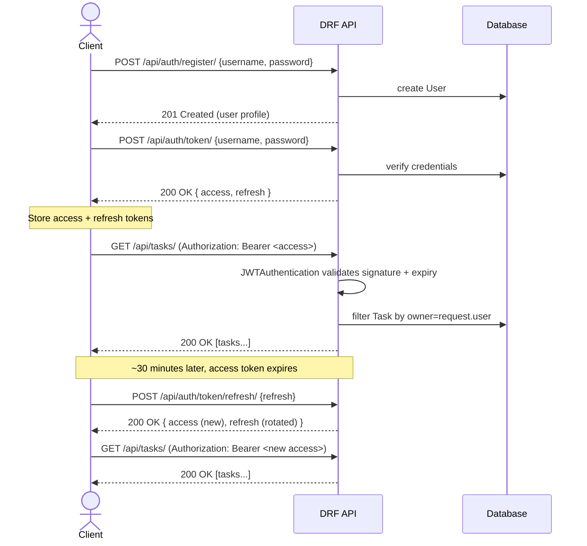

# Task Manager API

A clean, production-style **CRUD REST API** built with **Django REST Framework**, featuring **JWT authentication**, ownership-scoped permissions, filtering/search/pagination, and fully interactive **Swagger/ReDoc** documentation plus a ready-to-import **Postman collection**.

This project is a portfolio piece demonstrating core DRF service skills:

- Token-based (JWT) auth flow: register → login → access/refresh → protected requests
- A real CRUD resource (`Task`) with per-user data isolation
- Auto-generated OpenAPI 3 schema, Swagger UI, and ReDoc
- A Postman collection that mirrors the same flow, with auto-saved tokens
- A scripted demo (`demo.py`) you can run live or record for a Loom walkthrough
- An automated test suite covering auth and CRUD behaviour

## Tech stack

| Layer          | Choice                                   |
|----------------|-------------------------------------------|
| Framework      | Django 5/6 + Django REST Framework        |
| Auth           | `djangorestframework-simplejwt` (JWT)     |
| API docs       | `drf-spectacular` (OpenAPI 3 / Swagger UI / ReDoc) |
| Filtering      | `django-filter`                           |
| DB             | SQLite (swap for Postgres in production via `DATABASES`) |
| Docs & testing | Postman collection + `demo.py` + Django test suite |

## Project structure

```
auth_flow_project/
├── config/                # Django project settings, root urls
├── accounts/              # Registration, "me" endpoint, JWT token views
├── tasks/                 # Task model, serializer, viewset, filters, tests
├── demo.py                # End-to-end scripted demo (great for Loom recordings)
├── postman_collection.json
├── postman_environment.json
├── requirements.txt
├── .env.example
└── manage.py
```

## 1. Setup

```bash
# from inside auth_flow_project/
python -m venv venv
venv\Scripts\activate          # Windows
# source venv/bin/activate     # macOS/Linux

pip install -r requirements.txt

copy .env.example .env         # Windows (or: cp .env.example .env)

python manage.py migrate
python manage.py createsuperuser   # optional, for /admin/
python manage.py runserver
```

The API is now running at `http://127.0.0.1:8000/`.

## 2. API documentation

| Doc                | URL                                 |
|---------------------|--------------------------------------|
| Swagger UI          | `http://127.0.0.1:8000/api/docs/`   |
| ReDoc               | `http://127.0.0.1:8000/api/redoc/`  |
| Raw OpenAPI schema  | `http://127.0.0.1:8000/api/schema/` |
| Django admin        | `http://127.0.0.1:8000/admin/`      |

Swagger UI supports **"Authorize"** with a bearer JWT, so you can call every endpoint directly from the browser once you've logged in via `/api/auth/token/`.

> **Screenshot:** run the server, open `/api/docs/`, log in via "Authorize" with a bearer token from `/api/auth/token/`, and capture the endpoint list + an expanded request/response — that's your documentation screenshot for the gig portfolio.

### Postman

1. Import `postman_collection.json` and `postman_environment.json` into Postman.
2. Select the **"Task Manager API - Local"** environment.
3. Run **1. Auth → Register**, then **1. Auth → Login** — the access/refresh tokens are automatically captured into collection variables and reused by every request under **2. Tasks (CRUD)**.
4. Run the CRUD requests in order (Create → List → Retrieve → Update → Delete) to exercise the full flow, or use Postman's **Runner** to execute the whole collection in one click for your documentation screenshot.

## 3. Endpoints

### Auth (`/api/auth/`)

| Method | Endpoint            | Auth required | Description                          |
|--------|----------------------|:--------------:|---------------------------------------|
| POST   | `register/`          | No             | Create a new user account            |
| POST   | `token/`              | No             | Login — obtain access + refresh JWT  |
| POST   | `token/refresh/`      | No (refresh token)| Exchange refresh token for new access token |
| POST   | `token/verify/`       | No             | Verify a token is still valid        |
| GET    | `me/`                 | Yes            | Get the authenticated user's profile |

### Tasks (`/api/tasks/`)

| Method | Endpoint         | Auth required | Description                                    |
|--------|-------------------|:--------------:|--------------------------------------------------|
| GET    | `tasks/`          | Yes            | List **your** tasks (paginated, filterable, searchable, orderable) |
| POST   | `tasks/`          | Yes            | Create a task (owner set automatically)         |
| GET    | `tasks/{id}/`     | Yes            | Retrieve a single task you own                  |
| PUT    | `tasks/{id}/`     | Yes            | Replace a task you own                          |
| PATCH  | `tasks/{id}/`     | Yes            | Partially update a task you own                 |
| DELETE | `tasks/{id}/`     | Yes            | Delete a task you own                           |

Query params on `GET /api/tasks/`: `completed`, `priority`, `due_before`, `due_after`, `search` (title/description), `ordering` (e.g. `-created_at`), `page`.

Every task is scoped to its owner — users can never see or modify another user's tasks (enforced both in `get_queryset()` and via an `IsOwner` object permission, and covered by tests).

## 4. Auth flow diagram

JWT flow used by this API — register once, then login to get a short-lived **access** token (30 min) and a longer-lived **refresh** token (1 day), and use the refresh token to get new access tokens without re-entering credentials:


*(Rendered PNG/SVG versions live in `docs/auth_flow.png` and `docs/auth_flow.svg`; source is `docs/auth_flow.mmd` — regenerate with `npx @mermaid-js/mermaid-cli -i docs/auth_flow.mmd -o docs/auth_flow.png -b white -s 3` if you edit it.)*

<details>
<summary>Mermaid source</summary>



</details>

## 5. Live/recorded demo

`demo.py` scripts the entire flow end-to-end against a running server, printing every request/response — ideal to run live or to narrate while recording a Loom:

```bash
python manage.py runserver     # in one terminal
python demo.py                 # in another terminal
```

It walks through: register → login → `me` → create task → list (filtered) → retrieve → update (`PATCH`) → refresh token → delete → confirm 404. Each step prints the HTTP method, URL, status code, and JSON body, so it's easy to talk through on camera.

## 6. Running the test suite

```bash
python manage.py test
```

Covers: registration validation, login/JWT issuance, unauthenticated access being rejected, full CRUD on tasks, per-user data isolation (one user can't see/edit another's tasks), filtering, and search.

## 7. Notes on design choices

- **Ownership scoping**: `TaskViewSet.get_queryset()` always filters by `request.user`, and `IsOwner` double-checks on object-level actions — defense in depth against IDOR-style bugs.
- **JWT over session auth**: stateless, mobile/SPA-friendly, and matches what most clients expect from a DRF API.
- **`drf-spectacular` over hand-written docs**: the schema is generated from the actual serializers/views, so docs can't drift out of sync with the code.
- **SQLite for the demo**: zero setup. Swap `DATABASES` for Postgres/MySQL in `config/settings.py` for production use — no application code changes required.
